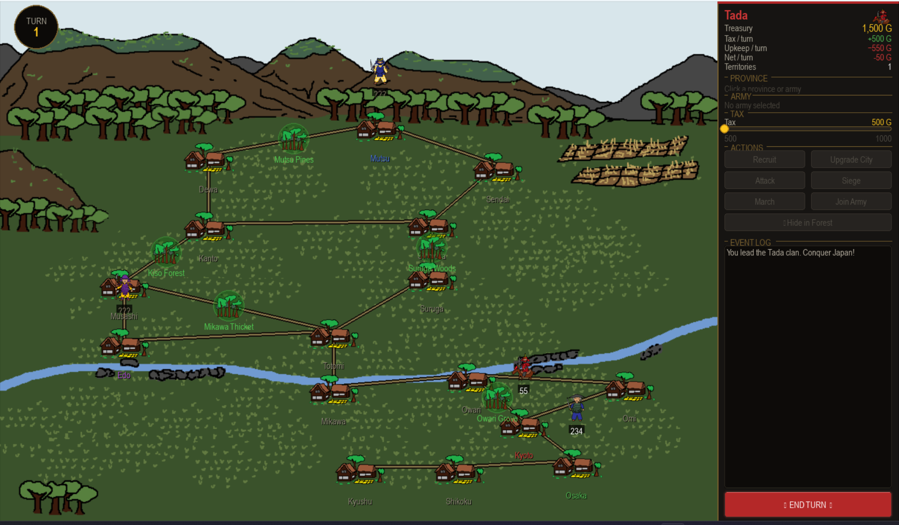
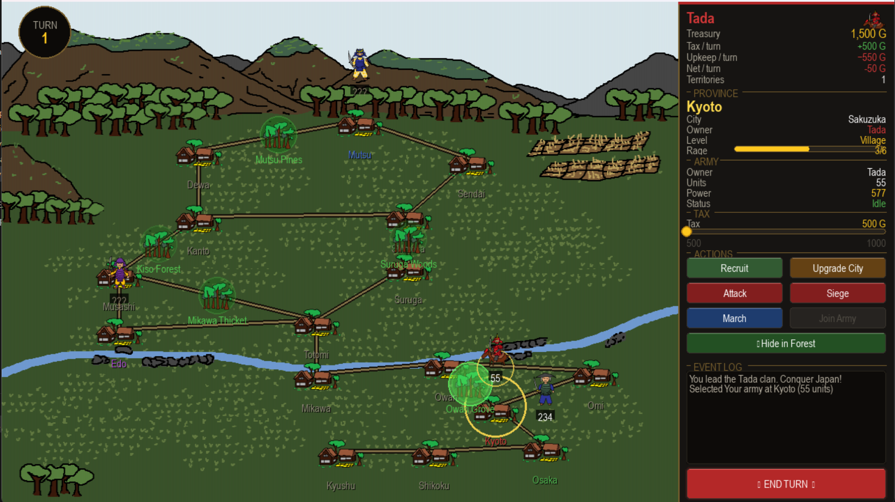
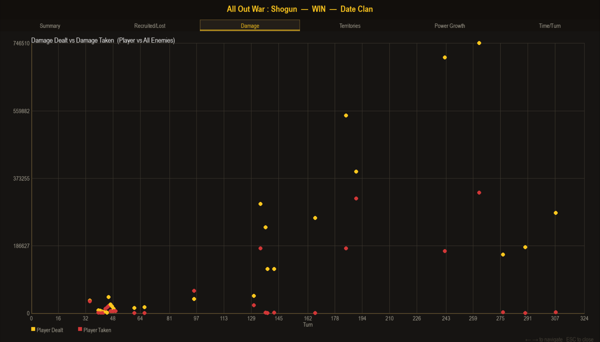

# ALL OUT WAR : SHOGUN

## Project Description

- **Project by:** Phunnipath Theankaew
- **Game Genre:** Real-Time Strategy (RTS)

**All Out War: Shogun** is a real-time strategy game where players act as a warlord aiming to become the Shogun — the supreme ruler of Japan. Players select one of four clans, each with unique military strengths, manage city upgrades to expand their army, and carefully balance taxation and finances. Poor financial management leads to debt, while excessive taxation triggers rebellions and the loss of entire cities — making both military strategy and economic control essential to victory.

> Inspired by *Total War: Shogun 2* by Sega, this is a smaller 2D game based on historical actions and events of the **Sengoku period** (the Warring States period of Japan).

---

## Problem This Project Solves

Players must manage warfare and city finances simultaneously, but the game **lacks a system to clearly track and analyze player actions and resource usage**. As a result, players may not understand why they fall into debt, lose cities, or trigger rebellions.

This project solves this by developing a system that **records player actions and presents the data through graphs and reports**, helping players evaluate their strategies and make better decisions.

---

## Installation

Clone this project:
```sh
git clone https://github.com/phunnipathtkasetsart/all_out_war_shogun.git
```

Create and activate a Python virtual environment:

**Windows:**
```bat
python -m venv .venv
.venv\Scripts\activate
pip install -r requirements.txt
```

**Mac:**
```sh
python3 -m venv .venv
source .venv/bin/activate
pip install -r requirements.txt
```

---

## Running the Game

After activating the Python environment:

**Windows:**
```bat
python game.py
```

**Mac:**
```sh
python3 game.py
```

---

## Gameplay



---

## Tutorial / Usage

### 1. Choose Your Clan

Select one of four primary clans, each with distinct specialties:

| Clan | Unit Name | Units | Base Damage | Specialty |
|------|-----------|-------|-------------|-----------|
| Tada | Katana Cavalry | 55 | 10.5 | Elite cavalry with high base damage |
| Date | Odachi Senshi | 60 | 10.0 | Odachi specialists with high base damage |
| Nori | Katana Ashigaru | 180 | 2.9 | Overwhelming numbers + 1.30× recruitment bonus |
| Abe | Yari Senshi | 100 | 6.2 | Yari specialists with strong anti-cavalry bonus |

### 2. Understand the Right Panel

Your command center for managing:

- **Clan Financials** — View your treasury, tax income, and upkeep. If upkeep exceeds net revenue, you fall into debt.
- **Unit Details** — View army stats. Recruit soldiers from cities; higher city levels allow more recruitment.
- **City Details** — Shows current tax rates and Rage levels.
- **Taxing & Rage** — Taxes can be set high, but this increases Rage. If Rage reaches level 6, you lose the province to a rebellion.
- **Actions of Conquest** — March, Attack, Siege, Ambush, and Join Army.

### 3. Actions of Conquest



- **March** — Select your unit on the map and click March, then select a destination. Army size dictates range — larger armies move shorter distances. *You must follow established routes and cannot pass enemy castles or obstacles.*

- **Attack** *(during march)* — Click Attack to engage nearby enemies you intercept along routes.

- **Ambush** *(during march)* — Click Hide in Forest to hide your army in nearby forests. When an enemy passes through, they are forced into combat and you receive a **first-strike bonus**.

- **Recruit / Upgrade** — Click your city options in the right panel to recruit new Soldiers or upgrade the city hall (Village → Citadel). Note: upgrading and recruiting cannot happen simultaneously.

- **Siege** — Click Siege and select a target enemy city. Defenders consist of recruited soldiers + default guards (or guards only if no soldiers are present).

- **Join Army** — Click Join Army to merge with a nearby army within a city.

### 4. Managing Taxes & Public Order (Rage)

Tax income scales from `500–1000 × city level multiplier`. Rage levels range from 1–6:

- If `(garrison units × 10) + (soldier units × 10) > tax` → Rage resets to default (3) on collection
- If `(garrison units × 10) + (soldier units × 10) < tax` → Rage decreases by 1 next turn
- Otherwise → Rage increases by +1 every turn

> If Rage reaches level 6, you will lose the province to a rebellion.

---

## Objectives

Conquer all **16 provinces** on the map while overcoming enemy AI factions.

| Condition | Result |
|-----------|--------|
| Conquer all cities | **Win** |
| Player territory reaches 0 | **Lose** |

---

## Game Features

### Data Visualization

After each game ends (win or loss), the game generates an in-depth analytics report consisting of **1 summary table** and **5 graphs**. Or load the game save manually



Every player action is logged as its own row. A 20-turn game produces roughly **100–200 rows** (e.g., each battle logs 2 rows, each recruit logs 1 row). Players can also load statistics from previously completed games — each stored as a separate CSV file — to regenerate graphs and tables for analysis.

#### Summary Table

| Metric | Value |
|--------|-------|
| Total Turns | 120 |
| Soldiers Recruited | 1,250 |
| Soldiers Lost | 980 |
| Cities Gained | 12 |
| Cities Lost | 8 |
| Total Damage Dealt | 5,430 |
| Total Damage Taken | 4,870 |
| Game Result | Win |

#### Graphs

| Feature | Objective | Chart Type |
|---------|-----------|------------|
| Soldiers Recruited vs Lost | Measure recruitment efficiency and bot difficulty | Stacked Bar Chart |
| Damage Dealt vs Taken | Compare total damage for player vs AI | Scatter Plot |
| Cities Gained vs Lost | Measure territorial efficiency | Bar Chart |
| Military Growth Over Time | Show overall power growth across turns | Cumulative Line Chart |
| Time Per Turn | Track average decision-making time | Line Chart |

### Data Recording

Game data is saved to a uniquely named CSV file per session in the format `game[#]_day-month-year`:

```
Game_1_29-3-2026.csv
Game_2_30-3-2026.csv
```


## Document Version History

| Version | Date | Editor |
|---------|------|--------|
| 1.1 | 12 March 2025 | Phunnipath Theankaew |
| 1.2 | 21 March 2025 | Phunnipath Theankaew |
