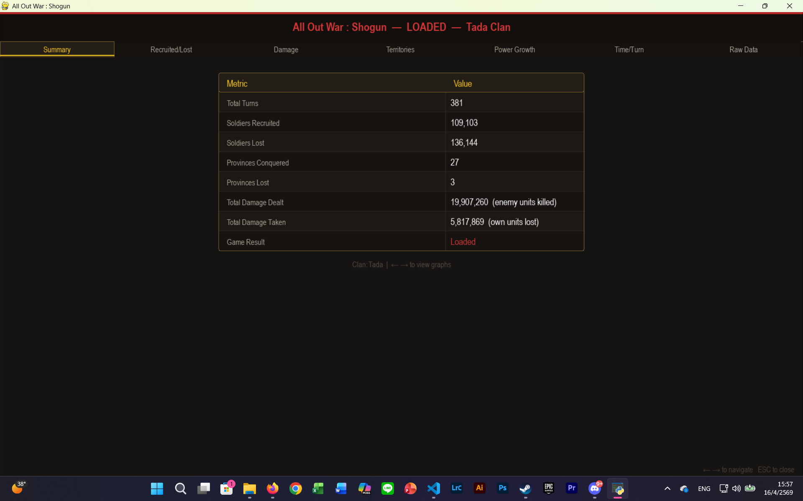
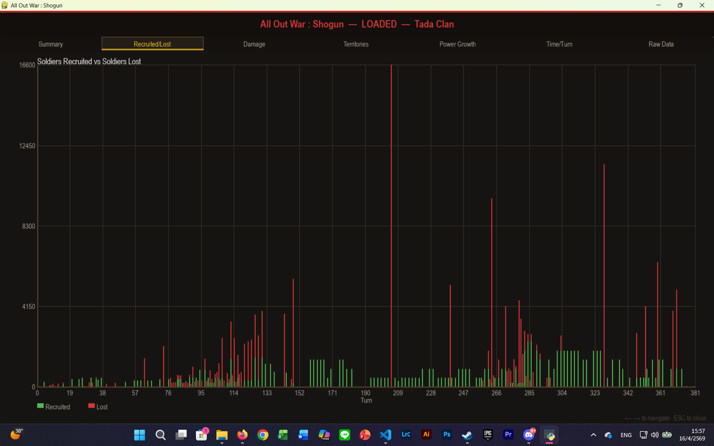
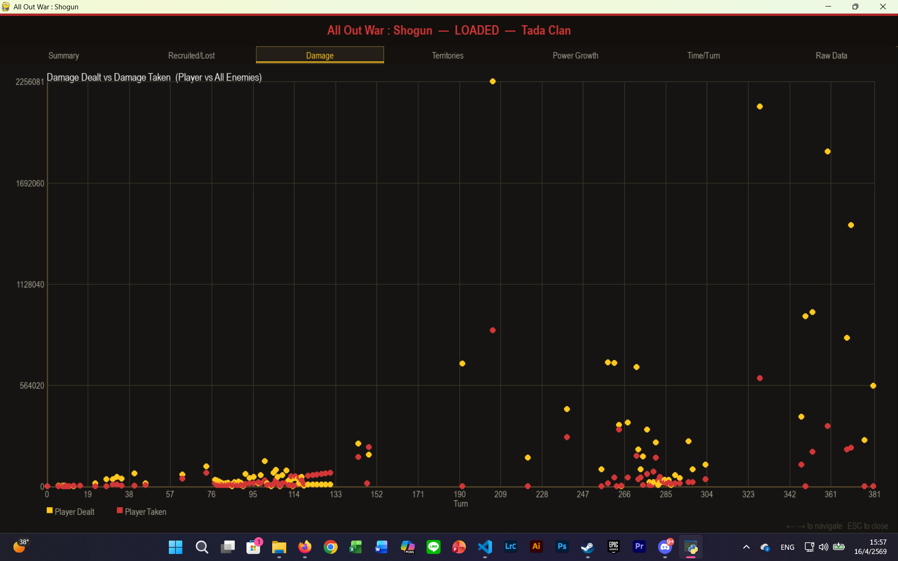
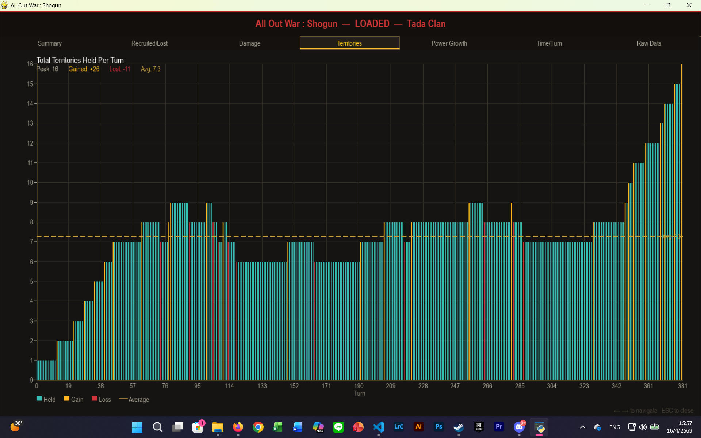
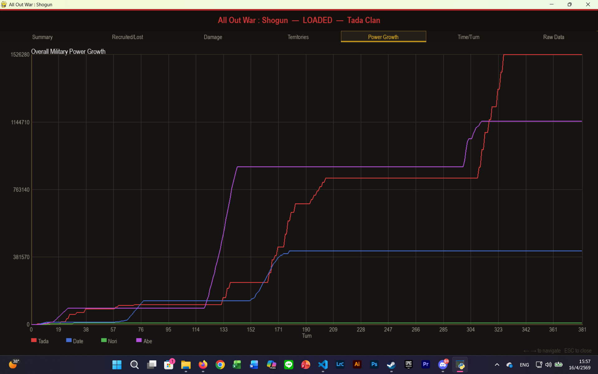
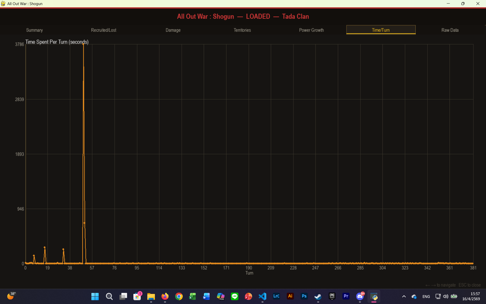
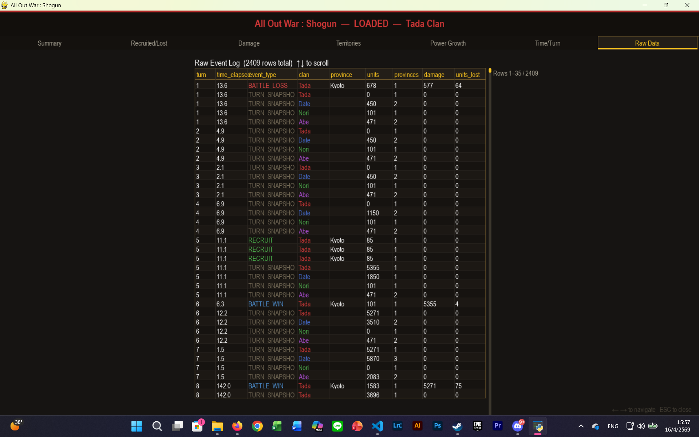

# Data Visualization — All Out War: Shogun

Every player action is recorded as a row in a CSV file during gameplay. A 20-turn game produces roughly **100–200 rows**; larger games can reach thousands (e.g., the example game below logged **2,409 rows** over 381 turns). This raw data is the foundation for **5 graphs** and **1 summary table**, all generated in-game after the game ends (win or loss).

Players can also **load statistics from a previously saved game** — each game is stored as its own CSV file — to regenerate graphs and tables for analysis at any time.

---

## Data Recording

Game data is saved automatically to a uniquely named CSV file per session:

```
Game_1_29-3-2026.csv
Game_2_30-3-2026.csv
```

### CSV Fields

| Field | Type | Description |
|-------|------|-------------|
| `turn` | int | The turn number the event occurred |
| `time_elapsed` | float | Seconds spent on this turn (measured from turn start) |
| `event_type` | string | Type of event (see below) |
| `clan` | string | The clan that triggered the event |
| `province` | string | Province name (if applicable) |
| `units` | int | Units involved or enemy power dealt to player |
| `provinces` | int | Total territories held by clan at time of log |
| `damage` | int | Player's power dealt to enemy |
| `units_lost` | int | Actual soldier units lost |

### Event Types Logged

| Event | Trigger |
|-------|---------|
| `RECRUIT` | Player recruits soldiers in a city |
| `BATTLE_WIN` / `BATTLE_LOSS` | Field battle result (1 row per side) |
| `SIEGE_WIN` / `SIEGE_LOSS` | Siege result |
| `AMBUSH_WIN` / `AMBUSH_LOSS` | Ambush result |
| `REBELLION` | A city is lost to rebellion |
| `TURN_SNAPSHOT` | End-of-turn snapshot for every active clan (used for power growth and territory tracking) |

---

## Stats Screen

The stats screen is accessible after the game ends. Navigate between pages using **← →** arrow keys. Press **ESC** to close.

**Navigation tabs:**
`Summary` → `Recruited/Lost` → `Damage` → `Territories` → `Power Growth` → `Time/Turn` → `Raw Data`

---

## 1. Summary Table

A quick overview of all key performance metrics for the game session.



| Metric | Description |
|--------|-------------|
| Total Turns | Total number of turns the game lasted |
| Soldiers Recruited | Cumulative units recruited by the player |
| Soldiers Lost | Cumulative units lost in battle |
| Provinces Conquered | Total provinces gained (siege wins) |
| Provinces Lost | Provinces lost to enemies or rebellion |
| Total Damage Dealt | Sum of player's power dealt to enemies across all battles |
| Total Damage Taken | Sum of enemy power dealt to the player |
| Game Result | Win / Loss / Loaded |

> **Source:** Derived from filtering `RECRUIT`, `BATTLE_*`, `SIEGE_*`, `AMBUSH_*`, and `REBELLION` event rows. Logged in `game.py`.

---

## 2. Soldiers Recruited vs Soldiers Lost

A stacked bar chart comparing soldiers recruited (green) and soldiers lost (red) per turn.



- **X-Axis:** Turn number
- **Y-Axis:** Number of soldiers
- **Green bars:** Units recruited that turn (`RECRUIT` events)
- **Red bars:** Units lost in battle that turn (`BATTLE_*`, `SIEGE_*`, `AMBUSH_*` events — `units_lost` field)

**Objective:** Measure recruitment efficiency and evaluate how hard the enemy AI is. Large red spikes with few green bars indicate turns of heavy loss without replenishment.

> **Source:** `RECRUIT` and battle events filtered from CSV. Logged in `game.py`.

---

## 3. Damage Dealt vs Damage Taken

A scatter plot comparing player damage dealt (yellow) vs damage taken (red) per turn.



- **X-Axis:** Turn number
- **Y-Axis:** Damage value
- **Yellow dots:** Player's power dealt to enemy (`damage` field)
- **Red dots:** Enemy power dealt to player (`units` field)

**Objective:** Identify which battles were costly vs efficient. Clustered yellow well above red indicates dominant performance; red above yellow indicates turns where the player took significant damage.

> **Source:** `BATTLE_WIN`, `BATTLE_LOSS`, `SIEGE_WIN`, `SIEGE_LOSS`, `AMBUSH_WIN`, `AMBUSH_LOSS` events. Logged in `game.py`.

---

## 4. Total Territories Held Per Turn

A bar chart showing how many provinces the player held each turn, color-coded by territory change.



- **X-Axis:** Turn number
- **Y-Axis:** Number of territories held
- **Teal bars:** Held (no change from previous turn)
- **Yellow bars:** Gained a territory this turn
- **Red bars:** Lost a territory this turn
- **Dashed line:** Average territories held across all turns

**Subtitle stats shown:** Peak territories, total gained, total lost, average held.

**Objective:** Track territorial expansion and identify when the player was gaining or losing ground throughout the campaign.

> **Source:** `provinces` field from `TURN_SNAPSHOT` events, with carry-forward filling for turns without snapshots. Logged in `game.py`.

---

## 5. Overall Military Power Growth

A cumulative line chart tracking total military power for every active clan over time.



- **X-Axis:** Turn number
- **Y-Axis:** Clan's military power (`units × damage`)
- **Each line = one clan**, color-coded:
  - 🔴 Red — Tada
  - 🔵 Blue — Date
  - 🟢 Green — Nori
  - 🟣 Purple — Abe

Power is displayed as a **cumulative maximum** — it only goes up — giving a clear picture of peak strength reached by each faction over the course of the game.

**Objective:** Compare the player's military growth against AI factions and identify when each clan peaked or stagnated.

> **Source:** `units` field from `TURN_SNAPSHOT` events, one row per clan per turn. Logged in `clans.py`.

---

## 6. Time Spent Per Turn

A line chart showing how many seconds the player spent on each turn.



- **X-Axis:** Turn number
- **Y-Axis:** Time in seconds
- **Orange line/dots:** Time elapsed per turn (`time_elapsed` field from `TURN_SNAPSHOT`)

**Objective:** Track decision-making speed over the game. Early spikes often reflect learning or complex early-game decisions; later turns typically flatten as the player develops a routine.

> **Source:** `time_elapsed` field from `TURN_SNAPSHOT` events. Logged in `game.py`.

---

## 7. Raw Data Viewer

An in-game scrollable table showing every logged event row from the CSV.



- Displays all columns: `turn`, `time_elapsed`, `event_type`, `clan`, `province`, `units`, `provinces`, `damage`, `units_lost`
- **Scroll** using ↑ ↓ arrow keys or mouse wheel
- Rows are color-coded by event type and clan for readability
- Shows total row count (e.g., `2409 rows total`) and current scroll position

**Objective:** Allow players and developers to inspect raw logged data directly in-game without opening the CSV file externally.

---

## Implementation Reference

All visualization and data logic is implemented in `stats.py`:

| Function | Purpose |
|----------|---------|
| `StatsLogger` | Class that manages CSV creation, event logging, and file loading |
| `StatsLogger.log()` | Appends a single event row to memory |
| `StatsLogger.save()` | Writes all rows to the CSV file |
| `StatsLogger.load()` | Loads rows from an existing CSV for replay analysis |
| `_summarise()` | Derives summary stats (totals) from raw rows |
| `_per_turn()` | Builds per-turn arrays for all 5 graphs |
| `show_stats_screen()` | Main Pygame loop rendering all pages |
| `_draw_summary_table()` | Renders the summary metrics table |
| `_draw_stacked_bar()` | Renders the Recruited vs Lost chart |
| `_draw_scatter()` | Renders the Damage Dealt vs Taken chart |
| `_draw_territory_chart()` | Renders the Territories Held chart |
| `_draw_cumulative_line()` | Renders the Military Power Growth chart |
| `_draw_line_chart()` | Renders the Time Per Turn chart |
| `_draw_raw_data()` | Renders the scrollable raw event log table |
